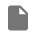

# Руководство пользователя


### Просмотр файлов и папок
-  Папки отображаются в виде папки
-  Файлы отображаются в виде документа
-  Синяя звездочка указывает на избранные элементы
-  Пустая звездочка - элемент не в избранном

### Навигация
1. Кликните по папке, чтобы открыть её содержимое
2. Используйте хлебные крошки для быстрой навигации
3. Нажмите на дом чтобы вернуться в корневую папку

### Работа с избранным
- Нажмите ✩ чтобы добавить в избранное
- Нажмите ★ чтобы убрать из избранного
- Избранные элементы сохраняются между сеансами

## Установка и запуск проекта

### Предварительные требования
- Node.js версии 18+
- npm/yarn/pnpm
- Git (для клонирования репозитория)

### 1. Клонирование репозитория
```bash
git clone <URL-вашего-репозитория>
cd rsht_file_system
```

### 2. Установка зависимостей
```bash
npm install
# или
yarn install
# или
pnpm install
```

### 3. Запуск в режиме разработки
```bash
npm run dev
# или
yarn dev
# или
pnpm dev
```

После запуска приложение будет доступно по адресу:
`http://localhost:5173` (или другому порту, который укажет Vite)

### 4. Сборка для production
```bash
npm run build
# или
yarn build
# или
pnpm build
```

## Структура проекта
- `src/` - исходный код приложения
- `public/` - статические файлы
- `dist/` - собранная версия (после build)
- `node_modules/` - зависимости

## Технологии
- React 19
- TypeScript
- Material UI (MUI)
- Zustand (управление состоянием)
- React Router (навигация)
- Vite (сборка)

## Поддержка
При возникновении проблем:
1. Проверьте версию Node.js (`node -v`)
2. Убедитесь, что все зависимости установлены
3. Проверьте консоль браузера и терминала на наличие ошибок
4. При необходимости создайте issue в репозитории проекта